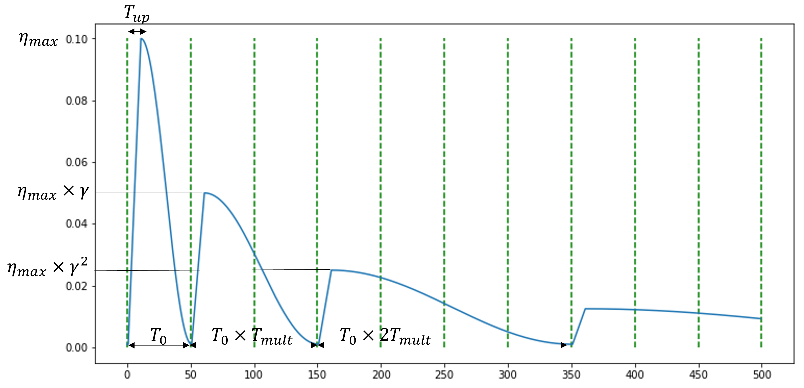

# Pseudo code
```python
# training loop
for images in image_loader:
    # images with shape [n, c, h, w]
    corrupted_images = corruption_method(images)
    loss = 0
    for _ in num_steps:
        corrupted_images = corrupted_images.detach()
        # stop gradients between inner-loop steps.
        energy_score = head(model(corrupted_images))
        # energy score with shape [n, 1]
        im_grad = autograd(energy_score.sum(), corrupted_images)
        # compute the gradient of input pixels along the direction
        # of energy maximization
        corrupted_images = corrupted_images - alpha * im_grad
        # gradient descent along the direction of energy minimization
        loss += criterion(corrupted_images, images)
    optimizer.zero_grad()
    loss.backward()
    optimizer.step()
```

# Hyperparameters
| Configurations | Pretraining | Finetuning |
| :--- | :--- | :--- |
| optimizer | AdamW | AdamW |
| base learning rate | 1e-4 | 1e-3 |
| learning rate schedular | Cosine decay | Cosine decay |
| weight decay | 0.05 | 0.05 |
| momentum of AdamW | β1 = 0.9, β2 = 0.95 | β1 = 0.9, β2 = 0.999 |
| layer-wise lr decay (Clark et al., 2020) | - | 0.75 |
| batch size | 256 | 1024 |
| drop path (Huang et al., 2016) | - | 0.1 |
| augmentation | RandomResizedCrop | RandAug (9, 0.5) (Cubuk et al., 2020) |
| label smoothing (Szegedy et al., 2016) | - | 0.1 |
| mixup (Zhang et al., 2018) | - | 0.8 |

